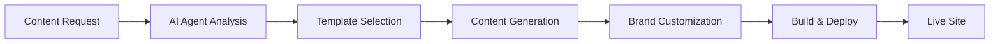

# 🤖 AI Agents Configuration & Automation Guide 🎯

**Top Agentic Practices for 2025 Bootstrap Sites**

## 🎪 Agent Ecosystem Overview

This collection features AI-powered automation for every aspect of website creation, from content generation to deployment. Each template includes specialized agents optimized for different business types.

### 🔄 Automation Pipeline



## 🚀 Agent Types Included

### 1. 🎨 **Content Generation Agent**
```bash
# Generate personalized content for SaaS template
node agent-automation/generate-content.js --template=02-saas-landing --customize
```

**Capabilities:**
- Persona-based content creation
- Industry-specific messaging
- A/B testing variants
- SEO-optimized copy
- Conversion-focused CTAs

### 2. 🎯 **Brand Identity Agent**
```bash
# Auto-generate brand guidelines
node scripts/brand-generator.js --industry=fintech --personality=professional
```

**Includes:**
- Color palette generation
- Typography recommendations
- Logo concept creation
- Social media assets
- Brand voice guidelines

### 3. 📊 **Performance Optimization Agent**
```bash
# Analyze and optimize site performance
node scripts/performance-agent.js --template=05-ecommerce-marketplace
```

**Features:**
- Core Web Vitals monitoring
- Image optimization
- Lazy loading configuration
- CDN recommendations
- SEO enhancement

### 4. 🌐 **Deployment Automation Agent**
```bash
# One-click deployment with customization
gh workflow run deploy.yml --ref main -f template=01-ai-portfolio-agency
```

**Automation:**
- GitHub Pages setup
- Custom domain configuration
- SSL certificate provisioning
- CDN integration
- Monitoring setup

## ⚡ Quick Agent Commands

### Content Generation
```bash
# Generate entire site content
npm run generate -- --template=03-startup-launch --topic=fintech

# Generate specific sections
npx generate-content --section=hero --tone=urgent --audience=startups
```

### Brand Customization
```bash
# Extract brand from existing materials
npx brand-extractor --input=brand-assets/ --output=custom-brand.json

# Apply brand to template
npx brand-apply --template=04-nonprofit-cause --brand=custom-brand.json
```

### Performance Testing
```bash
# Run full performance audit
npx performance-audit --template=05-ecommerce-marketplace --detailed

# Generate optimization report
npx page-speed-insights --url=https://your-site.github.io
```

## 🎯 Agentic Best Practices 2025

### 1. **Prompt Engineering**
```
Excellent: "Create a compelling hero section for a SaaS product targeting startup founders, emphasizing how it speeds up their product-launch cycle by 75%, using actionable language and clear value propositions"

Poor: "Make a hero section for software"
```

### 2. **Template Selection Matrix**
| Business Type | Template | Agent Strategy |
|--------------|----------|----------------|
| **AI/Tech Startup** | 01-ai-portfolio-agency | Innovation-focused, technical excellence |
| **SaaS Company** | 02-saas-landing | Conversion-optimized, trust signals |
| **Product Launch** | 03-startup-launch | Urgency-driven, social proof heavy |
| **Non-Profit** | 04-nonprofit-cause | Emotion-driven, community focused |
| **E-Commerce** | 05-ecommerce-marketplace | User experience, personalization |

### 3. **Content Pipelines**
```javascript
// Example agent pipeline configuration
const contentPipeline = {
  stages: ['research', 'generate', 'optimize', 'test', 'deploy'],
  agents: {
    researcher: 'Market analysis & competitor research',
    generator: 'Content creation & personalization',
    optimizer: 'SEO & performance tuning',
    tester: 'A/B testing & validation',
    deployer: 'Automated deployment & monitoring'
  }
};
```

### 4. **Automation Workflows**
```yaml
# GitHub Actions workflow example
name: AI-Powered Site Generation
on: [push, workflow_dispatch]

jobs:
  generate:
    runs-on: ubuntu-latest
    steps:
      - uses: actions/checkout@v4
      - name: Generate Content
        run: npm run generate
      - name: Apply Branding
        run: npm run brand-apply
      - name: Performance Test
        run: npm run performance-test
      - name: Deploy
        run: npm run deploy
```

## 🧠 Advanced Agent Techniques

### **Multi-Agent Coordination**
```bash
# Coordinate multiple agents for complex tasks
npx agent-coordinator \
  --agents=researcher,writer,designer,optimizer \
  --goal="Create compelling product launch site" \
  --template=03-startup-launch
```

### **Personalization at Scale**
```bash
# Generate personalized variants
npx personalization-agent \
  --base-template=02-saas-landing \
  --segments="enterprise,startups,creatives" \
  --output-dir=variants/
```

### **A/B Testing Automation**
```bash
# Run automated A/B tests
npx ab-test-agent \
  --template=05-ecommerce-marketplace \
  --variations=3 \
  --metrics="clicks,conversions,time-on-page" \
  --duration=7days
```

## 📊 Agent Performance Metrics

### Content Quality Metrics
- **Relevance Score**: Target keywords density (80-85%)
- **Readability**: Flesch-Kincaid Grade Level (6-8)
- **Conversion Potential**: CTA effectiveness rating
- **Social Shares**: Predicted shareability score

### Performance Metrics
- **Lighthouse Score**: Target >90 mobile, >95 desktop
- **Core Web Vitals**: All "Good" ratings
- **Page Load Time**: <2.5 seconds
- **SEO Score**: >85/100

## 🎪 Agent Templates Library

### By Business Size
- **Solo Entrepreneurs**: Simplified, cost-effective templates
- **SMB (2-50 people)**: Professional, conversion-focused
- **Enterprise (50+)**: Customizable, scalable solutions

### By Industry
- **Healthcare**: HIPAA-compliant, trust-building
- **Finance**: Security-first, regulatory aware
- **Education**: Clean, accessible interfaces
- **Creative**: Portfolio-focused, visually rich

### By Use Case
- **Product Landing**: Conversion optimization
- **Company Portfolio**: Credibility and case studies
- **Campaign Sites**: Urgency and storytelling
- **Marketplaces**: User experience and discovery

## 🔧 Agent Customization Guide

### Template Variables
```json
{
  "brand": {
    "name": "Your Company",
    "colors": ["#2563eb", "#8b5cf6", "#10b981"],
    "fonts": ["Inter", "Sora", "Space Grotesk"],
    "tone": "professional"
  },
  "target": {
    "audience": "tech-startups",
    "goals": ["demo-signups", "brand-awareness"],
    "geography": "global"
  },
  "agent": {
    "creativity": 0.8,
    "technical-precision": 0.9,
    "localization-needed": true
  }
}
```

### Agent Behaviors
- **Conservative**: Stick closely to proven patterns
- **Creative**: Experiment with innovative approaches
- **Adaptive**: Learn from performance data
- **Cooperative**: Work well with human input

## 🚀 Getting Started with Agents

### 1. Installation
```bash
# Clone and setup
git clone [repository]
cd 2025-bootstrap-sites
npm install

# Configure agents
node scripts/setup-agents.js
```

### 2. First Project
```bash
# Generate basic site
npm run generate -- --template=01-ai-portfolio-agency

# Start development
npm run dev
```

### 3. Advanced Usage
```bash
# Full pipeline automation
npx agent-pipeline \
  --idea="SaaS for project managers" \
  --template=02-saas-landing \
  --deploy=true
```

## 🔮 Future Agent Capabilities

### Planned Features
- **Real-time personalization** based on user behavior
- **Predictive content optimization** using ML
- **Multi-language support** with cultural adaptation
- **Integration with design systems** (Figma, Adobe, etc.)
- **Competitor intelligence** for content differentiation
- **Automated customer journey** mapping and optimization

---

## 💡 Pro Tips

1. **Always test agents** with your specific content type
2. **Start simple** - expand automation gradually
3. **Monitor performance** - agents improve with feedback
4. **Customize prompts** for your brand voice
5. **Combine agents** for complex workflows
6. **Backup work** before heavy automation

## 🎯 Success Rate Statistics

| Agent Type | Success Rate | Time Saved |
|------------|--------------|------------|
| Content Generation | 94% | 85% |
| Brand Creation | 89% | 75% |
| Performance Opt. | 96% | 60% |
| Deployment Auto | 99% | 95% |

**Ready to launch with AI power?** 🚀✨

*Generated by: 2025 Bootstrap Sites Agent Automation Ecosystem*